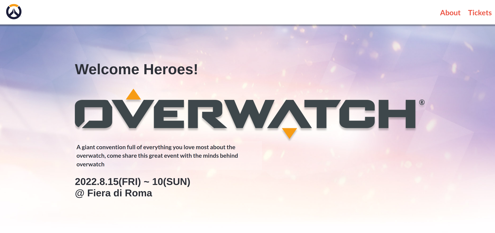
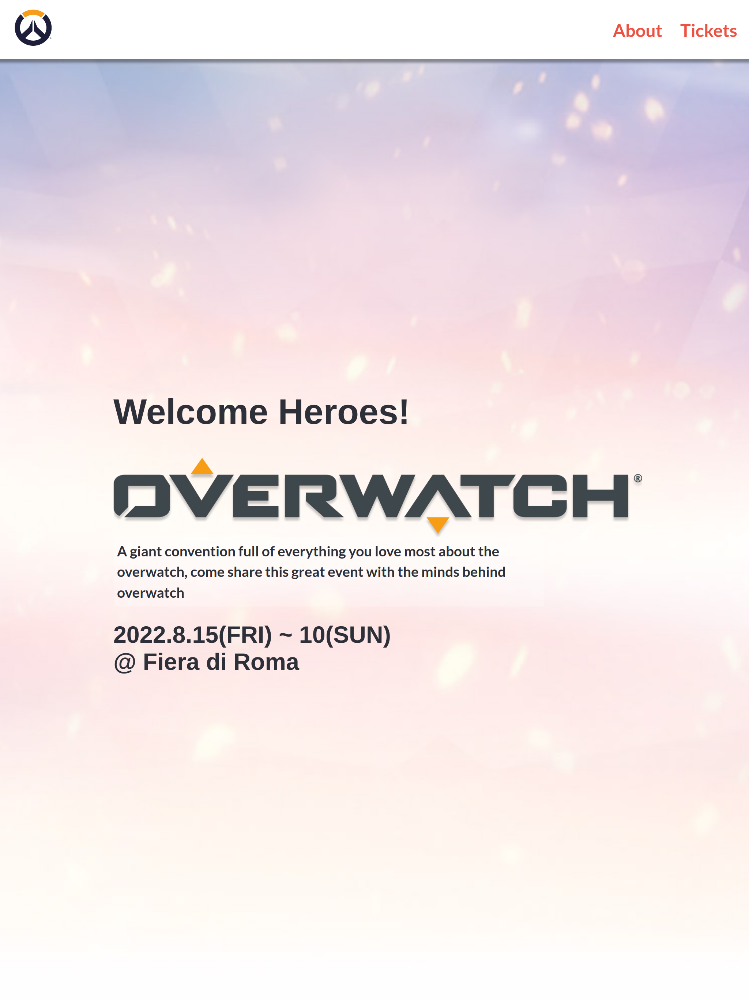
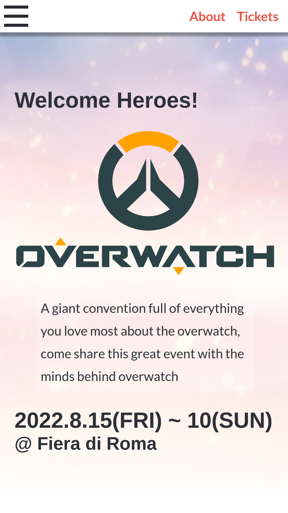

# OverWatch Convention Page (Capstone Project 1)

> OverWatch Convention responsive page, this project includes differnet stylings of screens i.e. Moble UI, Tablet UI, Desktop UI. Dynamic images and content develped using Flex boxes, Grids, Media Queries and Flaticon Icons. Created in base to the idea [by Cindy Shin in Behance](https://www.behance.net/adagio07)

## Desktop UI

## Tablet UI

## Phone UI

## Built With

- HTML
- CSS
- Linters
- Flaticon icons

## Live Demo

[Live Demo Link](https://helman101.github.io/overwatch-con/index.html)

## Authors

👤 **Author1**

- GitHub: [@helman101](https://github.com/helman101)
- LinkedIn: [LinkedIn](https://www.linkedin.com/in/helman-andres-5187271b1/)

## 🤝 Contributing

Contributions, issues, and feature requests are welcome!

- Forking the project
- Cloning the project to your local machine
- cd into the project directory
- Run git checkout -b your-branch-name
- Make your contributions
- Push your branch up to your forked repository
- Open a Pull Request with a detailed description to the development branch of the original project for a review

## Show your support

Give a ⭐️ if you like this project!

## Acknowledgments

- W3school page
- [Cindy Shin Original Idea](https://www.behance.net/gallery/29845175/CC-Global-Summit-2015)

## 📝 License

This project is [MIT](lic.url) licensed.
